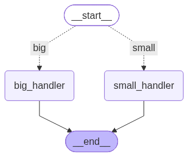

# 04_langgraph

LangGraph의 기본 그래프 구성 요소(StateGraph, 노드, 엣지)를 익히는 폴더.

## 핵심 개념
- StateGraph: 노드(함수)와 엣지(연결)로 워크플로우를 표현하는 그래프 빌더
- add_conditional_edges: 조건 함수의 반환값에 따라 다음 노드를 동적으로 선택하는 분기 처리
- START / END: 그래프의 시작/종료를 나타내는 특수 노드
- compile(): 빌더를 실행 가능한 그래프로 변환. 시각화(`get_graph()`)는 컴파일된 그래프에서만 가능

## 예제
- [`example/conditional_edges.py`](./example/conditional_edges.py) — 숫자 크기에 따라 서로 다른 노드로 분기하는 조건부 엣지 예제 (10 초과면 big_handler, 이하면 small_handler)

## 헷갈렸던 부분
- `.get_graph()`는 컴파일된 그래프(`app`)에서만 호출 가능 — 컴파일 전 `StateGraph` 빌더에는 없음
- VS Code에서 파일 저장(Cmd+S)을 안 하면 에디터 화면과 실제 실행되는 코드가 달라짐 (탭 이름 옆 점 표시로 저장 여부 확인)
